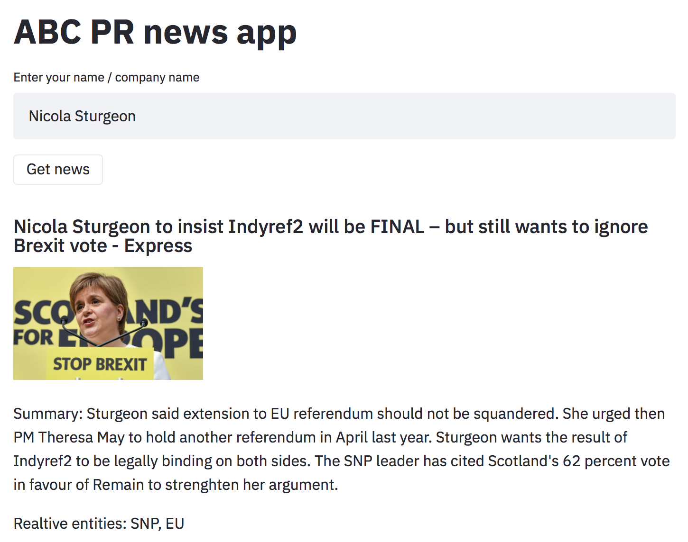

# ABC PR News Application

This is a prototype of a news application for a hypothetical public relations firm, ABC PR.

## Installation

The application is based in Python and requires the following packages:

* pandas 
* streamlit
* newsapi
* transformers[torch] - installs PyTorch torch automatically (required for the Transformers back-end)
* spacy
* newspaper

These can be installed with (after first sourcing into a newly-created virtual environment):

```
pip install -r requirements.txt
```

The next stage is to create an API key for [News API](https://newsapi.org), ours news aggregator. Once a key has been downloaded, place it in ```news_fetcher.py```.

## Usage

The application uses Streamlit for displaying news items on an interactive web page. 

To run the application, move to the top level of this directory and run the following command:

```
streamlit run main.py
```

This will open a new page on your default browser, using localhost as host. 

The application is now ready to be used! At the top is a text box for entering a search query, e.g., 'Nicola Sturgeon'. After that, press the 'Get news' button below it and live news will be displayed (for the current day), consisting of the article title, an image thumbnail, a summary of the article, and key entities relative to the queried entity. 

NOTE: To generate the article summaries, we use BART (BART-large-CNN), a pre-trained language model with summarisation capabilities. The first time the code is run, BART will automatically be downloaded, which may take some time. 

## Warning

It is possible to use BART for inference on a CPU. (Currently, the code is written to work on a CPU and not a GPU). However, because of the size of the BART model, we recommend using a powerful CPU when using this prototype.

Also, Transformers will raise a warning about using the model without further fine tuning - this is fine to ignore. 

## Screenshot

Here is a screenshot:




